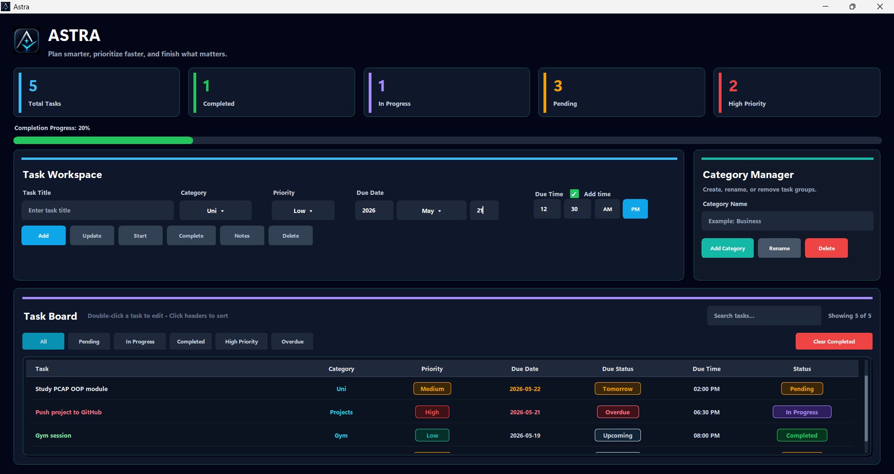

# ASTRA — Desktop Task Manager

**ASTRA** is a modern desktop task manager built with **Python** and **Tkinter**, designed to make task planning feel clean, fast, and focused.

The app combines a polished dark dashboard interface with practical productivity features such as task filtering, category management, priority tracking, due-date indicators, notes, and automatic local saving.



---

## Overview

ASTRA was built as a portfolio-focused Python desktop application that goes beyond a basic to-do list.  
It uses custom Tkinter components, a modular file structure, JSON-based persistence, and a custom task board interface to create a more professional user experience.

The goal of the project is to demonstrate practical Python skills, object-oriented programming, GUI development, file handling, input validation, and clean project organization.

---

## Key Features

### Task Management

- Add new tasks with title, category, priority, due date, and optional due time
- Update existing tasks
- Start tasks and mark them as in progress
- Complete tasks
- Delete tasks
- Add notes/details to tasks
- Clear all completed tasks

### Dashboard

- Total task count
- Completed task count
- In-progress task count
- Pending task count
- High-priority task count
- Completion progress bar

### Smart Due-Date System

ASTRA automatically classifies tasks based on their due date:

- **Overdue**
- **Today**
- **Tomorrow**
- **Upcoming**

This makes the task board easier to scan and more useful for daily planning.

### Filtering and Search

The task board supports quick filtering by:

- All tasks
- Pending tasks
- In-progress tasks
- Completed tasks
- High-priority tasks
- Overdue tasks

It also includes a search field for quickly finding tasks by title, category, priority, due date, time, or status.

### Category Manager

- Add new categories
- Rename existing categories
- Delete categories
- Automatically update tasks when categories change

### Local Data Saving

Tasks and categories are saved automatically to a local JSON file:

```text
astra_tasks.json
```

This means tasks remain available after closing and reopening the app.

The JSON file is ignored by Git using `.gitignore`, so personal task data is not uploaded to GitHub.

---

## Tech Stack

| Technology | Purpose |
|---|---|
| Python | Main programming language |
| Tkinter | Desktop GUI framework |
| Canvas | Custom rounded UI elements and task board rendering |
| JSON | Local task/category storage |
| OOP | Reusable widgets and organized application structure |

---

## Project Structure

```text
astra-task-manager/
├── main.py              # Application entry point
├── app.py               # Main application logic and UI assembly
├── config.py            # Colors, text, constants, and starting data
├── widgets.py           # Reusable custom Tkinter widgets
├── task_table.py        # Custom Canvas-based task board
├── utils.py             # Helper functions
├── Images/
│   └── screenshot.png   # README screenshot
├── .gitignore           # Files ignored by Git
└── README.md            # Project documentation
```

---

## How to Run

### 1. Clone the repository

```bash
git clone https://github.com/youssufathalla/astra-task-manager.git
```

### 2. Open the project folder

```bash
cd astra-task-manager
```

### 3. Run the application

```bash
python main.py
```

No external Python packages are required. ASTRA uses Python's built-in libraries.

---

## Skills Demonstrated

This project demonstrates:

- Python programming fundamentals
- Object-oriented programming
- GUI development with Tkinter
- Custom reusable widgets
- Event-driven programming
- Input validation
- File handling with JSON
- Modular code organization
- Search and filtering logic
- UI/UX design thinking
- GitHub project documentation

---

## Why This Project Is More Than a Basic To-Do List

Most beginner task manager projects use simple buttons, entries, and list boxes. ASTRA is different because it includes:

- A custom-designed dark dashboard interface
- A reusable component system
- A custom task board with badges and filters
- Persistent local storage
- Category management
- Notes/details support
- Due-date intelligence
- A clean multi-file architecture

These choices make the project closer to a real desktop productivity tool rather than a simple practice script.

---

## Future Improvements

Planned improvements include:

- Recurring tasks
- Reminder notifications
- Export/import task data
- Calendar-style task view
- Task statistics and productivity charts
- Light/dark theme switching
- Drag-and-drop task ordering

---

## Status

ASTRA is currently a functional desktop application with core task management, filtering, category management, notes, and automatic saving.

---

## License

This project is open for learning, improvement, and portfolio demonstration.
