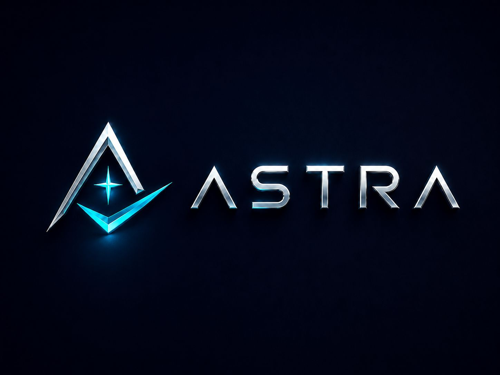

<p align="center">
  
</p>

# ASTRA — Desktop Task Manager

**ASTRA** is a modern desktop task manager built with **Python** and **Tkinter**, designed to make task planning feel clean, fast, and focused.

It combines a polished dark dashboard interface with practical productivity features such as task filtering, category management, priority tracking, due-date indicators, task notes, and automatic local saving.


---

## Overview

ASTRA was built as a portfolio-focused Python desktop application that goes beyond a basic to-do list.

The project demonstrates practical Python skills through a complete desktop application with a custom UI system, reusable Tkinter components, local JSON persistence, task filtering, category management, and a custom task board interface.

The goal of ASTRA is to show strong understanding of:

- Python fundamentals
- Object-oriented programming
- GUI development
- File handling
- Input validation
- Modular project structure
- User-focused interface design

---

## Key Features

### Task Management

- Add new tasks with title, category, priority, due date, and optional due time
- Update existing tasks
- Start tasks and mark them as in progress
- Complete tasks
- Delete tasks
- Add notes/details to tasks
- Clear all completed tasks

### Dashboard

ASTRA includes a live dashboard that tracks:

- Total tasks
- Completed tasks
- In-progress tasks
- Pending tasks
- High-priority tasks
- Completion progress percentage

### Smart Due-Date System

ASTRA automatically classifies tasks based on their due date:

- **Overdue**
- **Today**
- **Tomorrow**
- **Upcoming**

This makes the task board easier to scan and more useful for daily planning.

### Filtering and Search

The task board supports quick filtering by:

- All tasks
- Pending tasks
- In-progress tasks
- Completed tasks
- High-priority tasks
- Overdue tasks

It also includes a search field for quickly finding tasks by title, category, priority, due date, time, or status.

### Category Manager

ASTRA includes a built-in category manager that allows users to:

- Add new categories
- Rename existing categories
- Delete categories
- Automatically update tasks when categories change

### Local Data Saving

Tasks and categories are saved automatically to a local JSON file:

```text
astra_tasks.json
```

This means tasks remain available after closing and reopening the app.

The JSON file is ignored by Git using `.gitignore`, so personal task data is not uploaded to GitHub.

---

## Tech Stack

| Technology | Purpose |
|---|---|
| Python | Main programming language |
| Tkinter | Desktop GUI framework |
| Canvas | Custom rounded UI elements and custom task board rendering |
| JSON | Local task/category storage |
| OOP | Reusable widgets and organized application structure |

---

## Project Structure

```text
astra-task-manager/
├── main.py                # Application entry point
├── app.py                 # Main application logic and UI assembly
├── config.py              # Colors, text, constants, and starting data
├── widgets.py             # Reusable custom Tkinter widgets
├── task_table.py          # Custom Canvas-based task board
├── utils.py               # Helper functions
├── Images/
│   ├── logo.png           # README logo/banner
│   ├── screenshot.png     # README screenshot
│   ├── Icon.jpeg          # Astra icon image
│   └── astra_icon.ico     # Optional Windows executable icon
├── .gitignore             # Files ignored by Git
└── README.md              # Project documentation
```

---

## How to Run from Source

### 1. Clone the repository

```bash
git clone https://github.com/youssufathalla/astra-task-manager.git
```

### 2. Open the project folder

```bash
cd astra-task-manager
```

### 3. Run the application

```bash
python main.py
```

No external Python packages are required to run the source version. ASTRA uses Python's built-in libraries.

---

## Windows Executable

ASTRA can also be packaged as a standalone Windows executable using **PyInstaller**.

The generated executable should not be committed directly to the repository. Instead, it should be uploaded through **GitHub Releases** to keep the source code clean.

### Build the executable locally

Install the required build tools:

```powershell
python -m pip install --upgrade pip
python -m pip install pyinstaller pillow
```

Convert the app icon to `.ico` format:

```powershell
python -c "from PIL import Image, ImageOps; img=Image.open('Images/Icon.jpeg'); img=ImageOps.fit(img, (256,256)); img.save('Images/astra_icon.ico', sizes=[(256,256),(128,128),(64,64),(48,48),(32,32),(16,16)])"
```

Build the executable:

```powershell
pyinstaller --onefile --windowed --name Astra --icon=Images/astra_icon.ico --add-data "Images;Images" main.py
```

After the build finishes, the executable will be created at:

```text
dist/Astra.exe
```

### Recommended release method

The executable should be uploaded to the repository's **Releases** section:

```text
GitHub Repository → Releases → Create a new release → Upload Astra.exe
```

This keeps the main repository focused on source code while still allowing users to download the Windows app easily.

---

## Skills Demonstrated

This project demonstrates:

- Python programming fundamentals
- Object-oriented programming
- GUI development with Tkinter
- Custom reusable widgets
- Event-driven programming
- Input validation
- JSON file handling
- Local data persistence
- Modular code organization
- Search and filtering logic
- Custom Canvas-based interface design
- UI/UX design thinking
- GitHub project documentation

---

## Why This Project Is More Than a Basic To-Do List

Many beginner task manager projects use simple buttons, entries, and list boxes. ASTRA was designed to feel closer to a real desktop productivity tool.

It includes:

- A custom-designed dark dashboard interface
- A reusable component system
- A custom task board with badges and filters
- Persistent local storage
- Category management
- Notes/details support
- Due-date intelligence
- A clean multi-file architecture
- A branded visual identity

These choices make the project stronger as a portfolio application because it shows both programming ability and attention to user experience.

---

## Future Improvements

Planned improvements include:

- Recurring tasks
- Reminder notifications
- Export/import task data
- Calendar-style task view
- Task statistics and productivity charts
- Light/dark theme switching
- Drag-and-drop task ordering
- Optional cloud sync

---

## Status

ASTRA is currently a functional desktop application with core task management, filtering, category management, notes, due-date indicators, and automatic saving.

---

## License

This project is open for learning, improvement, and portfolio demonstration.